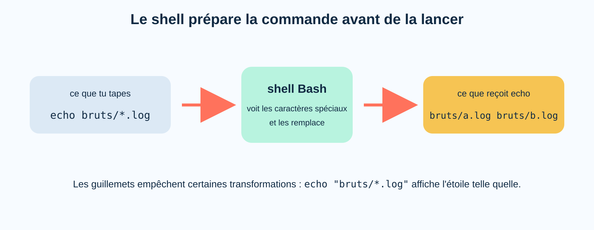
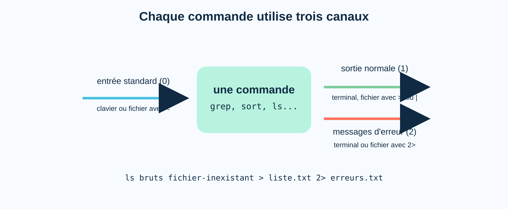
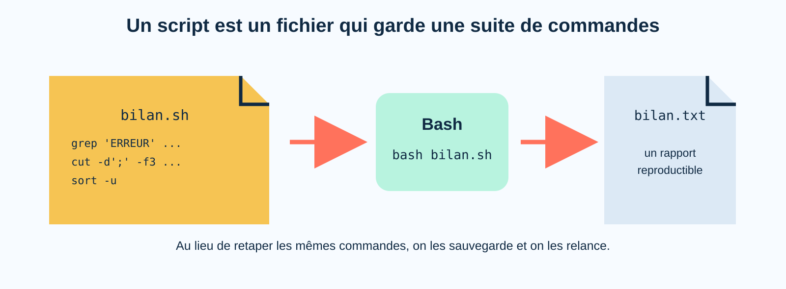

# TP 2 — Faire parler les traces du relais Aurore

## Mission 3 — Retrouver l'origine d'un signal de détresse

Le code reconstitué dans les archives de la station Nadir a ouvert un nouveau dossier. Il appartient au relais Aurore, une installation qui reçoit les communications de plusieurs balises isolées.

Aurore fonctionne encore, mais son rapport automatique est en panne. Il reste plusieurs milliers de lignes de journaux, un inventaire et des relevés de capteurs. Quelque part dans ces fichiers se trouve un signal de détresse. Ton travail consiste à retrouver sa source, sa zone et ses coordonnées, puis à conserver les commandes qui permettront de refaire l'analyse.


Le TP est prévu pour une séance de trois heures. S'il reste des niveaux, tu les reprendras à la séance suivante.

!!! warning "Périmètre sûr"
    Toutes les modifications doivent rester dans `~/base-exploration/tp2/relais-aurore`. Ne modifie pas les fichiers du dossier `bruts` et n'utilise pas `sudo`.

## Avant le TP — préparer le document de notes

- [Modèle de notes du TP2](../assets/tp2-modele-notes.txt)

Avant la séance, télécharge ce document sur ton ordinateur habituel. Ouvre-le avec l'éditeur de ton choix : Bloc-notes, Word, Google Docs, VS Code ou un autre outil avec lequel tu es à l'aise.

Ce document reste sur ton poste courant. Tu n'as pas besoin de le récupérer avec `wget` ni de l'ouvrir avec `nano` dans Linux. Garde-le ouvert pendant le TP, puis dépose la version complétée sur Moodle à la fin de la séance.

Les encadrés `Question - N01`, `N02`… indiquent les réponses à écrire dans ce document. Quand on te demande de prévoir un résultat, réponds avant de lancer la commande, puis ajoute ce que tu as réellement observé.

## Récupérer le relais dans Linux

- [Terrain de jeu — Relais Aurore](../assets/tp2-relais-aurore.zip)

Prépare le dossier du TP :

```bash
cd ~/base-exploration
mkdir tp2
cd tp2
```

Télécharge l'archive avec `wget`, puis décompresse-la :

```bash
wget https://valt78.github.io/cours-linux/assets/tp2-relais-aurore.zip
unzip tp2-relais-aurore.zip
cd relais-aurore
pwd
ls
cat 00-LIRE-MOI.txt
```

`wget` récupère ici l'archive depuis le site du cours et l'enregistre dans le dossier courant.

---

## Niveau 0 — Retrouver le canal de Nadir

La première information est cachée dans un nom commençant par un point :

```bash
ls
ls -a
cat .canal-nadir
```

Tu connais déjà les fichiers cachés : `ls -a` les affiche, mais ne change pas leurs droits et ne les rend pas secrets.

### `~` aide le shell, mais ne commence pas par `/`

Observe les deux commandes suivantes :

```bash
echo ~
pwd
```

Le shell remplace `~` par le chemin de ton dossier personnel avant de lancer `echo`. Le résultat obtenu commence bien par `/`, mais l'écriture `~` n'est pas elle-même un chemin absolu. Un chemin écrit sous forme absolue commence directement par `/`.

```text
~                                     raccourci développé par le shell
/home/alice                            chemin absolu
~/base-exploration/tp2                raccourci suivi d'un chemin
/home/alice/base-exploration/tp2      chemin absolu
```

!!! question "Question - N01 · `~` et chemin absolu"
    Explique avec tes mots pourquoi `~` mène bien à ton dossier personnel sans être, dans son écriture, un chemin absolu.

Va dans `/tmp`, puis reviens au relais avec le chemin complet affiché précédemment par `pwd`. Pour ce retour, n'utilise pas `~`.

Ensuite, passe par le dossier `documentation`, lis `format-communications.txt`, puis reviens au relais avec `..`.

!!! question "Question - N02 · Retrouver son chemin"
    Note le chemin absolu utilisé depuis `/tmp`. Dans la deuxième manipulation, que désignaient `.` et `..` ?

---

## Niveau 1 — Regarder le bon objet

### 1.1 `ls -l` ou `ls -ld` ?

Compare :

```bash
ls -l bruts
ls -ld bruts
```

Avec `ls -l bruts`, `ls` ouvre le dossier et décrit ce qu'il contient. L'option `-d` demande de décrire le dossier `bruts` lui-même.

Ajoute maintenant `-h` :

```bash
ls -lh bruts
```

`-l` demande l'affichage détaillé. `-h` rend notamment les tailles plus faciles à lire ; il ne crée pas à lui seul l'affichage détaillé.

### 1.2 `type` ne décrit pas un fichier

Essaie :

```bash
type cd
type ls
type bruts
```

`type` cherche une **commande** portant ce nom. Il peut dire que `cd` est intégré à Bash ou indiquer quel programme sera lancé pour `ls`. Il n'est pas fait pour reconnaître un fichier ou un dossier.

Pour examiner un objet du système de fichiers, utilise plutôt :

```bash
file bruts
file bruts/inventaire.csv
ls -ld bruts bruts/inventaire.csv
```

!!! question "Question - N03 · Commande ou objet du système de fichiers"
    Pourquoi `type bruts` ne répond-il pas à la question « est-ce un fichier ou un dossier » ? Quelles commandes t'ont donné la bonne information ?

À toi de trouver :

1. le plus gros fichier du dossier `bruts` ;
2. le type de `scripts/diagnostic.sh` ;
3. les droits du dossier `scripts` lui-même, pas ceux de son contenu.

!!! question "Question - N04 · Choisir les options de `ls`"
    Note les commandes utilisées pour les points 1 et 3. Explique précisément le rôle de `-l`, `-h` et `-d` dans ces commandes.

---

## Niveau 2 — Reprendre les droits avant l'enquête

Les droits restent un point important : une seule catégorie s'applique à la fois, et les lettres n'ont pas exactement le même effet sur un fichier et sur un dossier.


### 2.1 Le propriétaire ne récupère pas les droits du groupe

Le fichier suivant t'appartient. Donne la lecture au groupe, mais aucun droit au propriétaire ni aux autres :

```bash
chmod u=,g=r,o= laboratoire/categorie-groupe.txt
ls -l laboratoire/categorie-groupe.txt
cat laboratoire/categorie-groupe.txt
```

La lecture est refusée. Comme tu es propriétaire, Linux utilise la catégorie `u`. Il ne complète pas les droits manquants avec ceux de `g`, même si tu appartiens aussi au groupe du fichier.

Restaure ensuite un mode utilisable :

```bash
chmod u=rw,g=r,o= laboratoire/categorie-groupe.txt
```

!!! question "Question - N05 · Propriétaire et groupe"
    Avant le test, pensais-tu que `cat` fonctionnerait ? Explique maintenant pourquoi le droit `r` du groupe ne t'a pas permis de lire le fichier.

### 2.2 Le droit `w` d'un dossier

Observe le dépôt, puis retire ton droit d'écriture sur le dossier :

```bash
ls -ld laboratoire/depot
ls -l laboratoire/depot
chmod u-w laboratoire/depot
```

Teste maintenant trois actions :

```bash
touch laboratoire/depot/nouveau.txt
rm laboratoire/depot/temoin.txt
cat laboratoire/depot/temoin.txt
```

La création et la suppression modifient la liste des noms stockée dans le dossier : elles sont refusées. La lecture du témoin peut encore fonctionner, car elle dépend des droits du fichier et du droit de traverser le dossier.

Restaure immédiatement le droit retiré :

```bash
chmod u+w laboratoire/depot
```

!!! question "Question - N06 · Écrire dans un dossier"
    Pourquoi `rm laboratoire/depot/temoin.txt` dépend-il surtout du droit `w` sur `depot`, et non du droit `w` sur `temoin.txt` ?

### 2.3 Lire un mode numérique

Prépare le script de diagnostic ainsi :

```bash
chmod 640 scripts/diagnostic.sh
ls -l scripts/diagnostic.sh
./scripts/diagnostic.sh
```

Le mode `640` donne `rw-` au propriétaire, `r--` au groupe et aucun droit aux autres. Il manque donc `x` pour lancer le script directement.


Corrige le mode et relance-le :

```bash
chmod 750 scripts/diagnostic.sh
ls -l scripts/diagnostic.sh
./scripts/diagnostic.sh
```

!!! question "Question - N07 · Du nombre aux lettres"
    Traduis `750` sous la forme `rwx`. À qui s'appliquent les trois chiffres ? Quel droit manquait avec `640` ?

---

## Niveau 3 — Le shell prépare la commande

Avant de lancer un programme, Bash transforme certains caractères de la ligne saisie.



### 3.1 L'étoile cherche des noms

!!! tip "Question - N08 · Avant et après le test"
    Avant de lancer les deux commandes, note ce que tu penses voir et si `echo` va lui-même ouvrir le dossier `bruts`.

```bash
echo bruts/*.log
echo "bruts/*.log"
```

Sans guillemets, Bash remplace `bruts/*.log` par tous les noms correspondants, puis lance `echo`. Avec les guillemets, l'étoile est protégée et reste un simple caractère.

`echo` ne cherche donc aucun fichier : il affiche seulement les arguments préparés par Bash.

Complète ta réponse N08 après le test, puis liste tous les fichiers CSV de `bruts` avec une étoile, sans écrire leurs deux noms un par un.

### 3.2 Guillemets et substitution de commande

Compare :

```bash
echo 'Rapport créé le $(date +%H:%M)'
echo "Rapport créé le $(date +%H:%M)"
```

Dans les guillemets simples, tout reste du texte. Dans les guillemets doubles, Bash exécute `date +%H:%M` et remplace `$(...)` par le résultat obtenu. On appelle cela une **substitution de commande**.

!!! question "Question - N09 · Les guillemets"
    Explique pourquoi la première commande affiche les caractères `$(` alors que la seconde affiche une heure.

### 3.3 Créer plusieurs noms avec des accolades

```bash
echo rapports/{matin,soir}.txt
touch rapports/test-{matin,soir}.txt
ls rapports
```

Les accolades produisent ici deux mots à partir d'un même modèle. À toi de créer en une seule commande trois fichiers vides nommés `rapport-erreurs.txt`, `rapport-sources.txt` et `rapport-zones.txt` dans `rapports`.

Supprime ensuite uniquement ces trois fichiers de test. Garde `LISEZ-MOI.txt`.

---

## Niveau 4 — Lire et chercher sans tout afficher

Les journaux contiennent plus de trois mille lignes. `cat` afficherait tout d'un bloc ; ici, il existe de meilleurs outils.

### 4.1 Début, fin et nombre de lignes

```bash
head -n 3 bruts/communications-2026-09-21.log
tail -n 3 bruts/communications-2026-09-23.log
wc -l bruts/communications-2026-09-21.log
wc -l bruts/*.log
```

`head` montre le début, `tail` la fin et `wc -l` compte les lignes. Avec plusieurs fichiers, `wc` affiche un résultat par fichier puis un total.

!!! question "Question - N10 · Choisir le bon outil"
    Quel outil utiliserais-tu pour vérifier l'entête d'un journal, sa dernière transmission et son nombre de lignes ? Note aussi les fragments trouvés au début du 21 septembre et à la fin du 23 septembre.

### 4.2 Retrouver une ligne avec `grep`

```bash
grep 'CRITIQUE' bruts/communications-2026-09-22.log
grep -n 'CRITIQUE' bruts/communications-2026-09-22.log
grep -i 'signal-urgence' bruts/communications-2026-09-22.log
```

La forme générale est :

```text
grep [options] 'motif recherché' fichier
```

`-n` ajoute le numéro de la ligne trouvée. Il ne cherche pas davantage de résultats. `-i` ignore la différence entre majuscules et minuscules.

Essaie maintenant :

```bash
grep bruts/communications-2026-09-22.log 'CRITIQUE'
```

Dans cet ordre, `grep` prend le chemin pour le motif et essaie d'ouvrir un fichier nommé `CRITIQUE`. Lis le message, puis remets les deux arguments dans le bon ordre.

!!! question "Question - N11 · L'ordre de `grep`"
    Dans la commande précédente, qu'est-ce qui a été pris pour le motif et pour le fichier ? Explique aussi ce que change réellement l'option `-n`.

### 4.3 À toi de fouiller le 23 septembre

Trouve maintenant :

1. le nombre de lignes du journal du 23 septembre ;
2. sa dernière transmission ;
3. chaque ligne contenant `CRITIQUE`, avec son numéro ;
4. les lignes qui ne contiennent pas `INFO`, avec `grep -v`.

!!! question "Question - N12 · Fouille du 23 septembre"
    Note les quatre commandes et les informations importantes trouvées. Que fait `grep -v` ?

---

## Niveau 5 — Relier les commandes avec `|`

Une conduite, appelée *pipe*, envoie la sortie de gauche vers l'entrée de droite. Elle évite de créer un fichier temporaire entre chaque étape.


### 5.1 Sélectionner, puis compter

```bash
grep 'ERREUR' bruts/communications-2026-09-22.log | wc -l
```

Lis cette ligne de gauche à droite :

```text
grep garde les lignes contenant ERREUR  →  wc -l compte les lignes reçues
```

!!! tip "Question - N13 · Prévoir une conduite"
    Avant de lancer la commande suivante, note si le résultat sera une liste de lignes, un nombre ou un fichier.

```bash
grep -v 'INFO' bruts/communications-2026-09-21.log | wc -l
```

Après le test, explique ce que reçoit exactement `wc -l`.

### 5.2 Travailler sur plusieurs journaux

Compare :

```bash
grep 'CRITIQUE' bruts/*.log
grep -h 'CRITIQUE' bruts/*.log
```

Quand plusieurs fichiers sont lus, `grep` ajoute normalement leur nom devant chaque résultat. L'option `-h` masque ce préfixe. C'est pratique lorsqu'une commande suivante doit traiter uniquement le contenu des lignes.

```bash
grep -h 'CRITIQUE' bruts/*.log | wc -l
```

Construis maintenant une conduite qui compte toutes les lignes `ERREUR` dans les trois journaux. Vérifie d'abord séparément la sortie de `grep`, puis ajoute le comptage.

!!! question "Question - N14 · Construire une conduite"
    Note la commande finale et son résultat. Pourquoi tester d'abord la partie gauche aide-t-il à comprendre ou corriger la conduite ?

---

## Niveau 6 — Extraire, trier et transformer

Les cinq morceaux d'une communication sont séparés par des points-virgules. Relis rapidement leur ordre :

```bash
cat documentation/format-communications.txt
```


### 6.1 Extraire une colonne avec `cut`

```bash
head -n 3 bruts/communications-2026-09-22.log
head -n 3 bruts/communications-2026-09-22.log | cut -d';' -f2
head -n 3 bruts/communications-2026-09-22.log | cut -d';' -f3
```

- `-d';'` indique le caractère qui sépare les champs ;
- `-f2` conserve le deuxième champ ;
- `-f3` conserve le troisième.

`grep` choisit des **lignes**. `cut` choisit des **colonnes** à l'intérieur des lignes reçues.

### 6.2 Trier et retirer les doublons

```bash
grep -h 'ERREUR' bruts/*.log | cut -d';' -f3 | sort
grep -h 'ERREUR' bruts/*.log | cut -d';' -f3 | sort -u
```

`sort` range les lignes. Avec `-u`, il ne garde qu'une occurrence de chaque ligne identique.

!!! question "Question - N15 · De la ligne à la colonne"
    Décris chaque étape de la deuxième conduite. Quelle différence fais-tu maintenant entre `grep`, `cut` et `sort -u` ?

### 6.3 Remplacer des caractères avec `tr`

```bash
echo 'relais aurore' | tr '[:lower:]' '[:upper:]'
grep -h 'CRITIQUE' bruts/*.log | cut -d';' -f3,4 | tr ';' ' '
```

`tr` remplace ici les minuscules par des majuscules, puis le point-virgule par un espace. Il travaille sur les caractères qu'il reçoit.

À toi de produire dans le terminal :

1. les zones des lignes `CRITIQUE`, triées et sans doublon ;
2. les noms des éléments marqués `urgent` dans `bruts/inventaire.csv`, sans les autres colonnes ;
3. les sources des lignes `ERREUR`, triées et sans doublon ;
4. la source et la zone des lignes `CRITIQUE`, avec le point-virgule remplacé par un espace grâce à `tr`.

!!! question "Question - N16 · Choisir les filtres"
    Note les trois conduites et leurs résultats. Pour l'une d'elles, explique pourquoi l'ordre des commandes compte.

---

## Niveau 7 — Conserver les résultats dans des rapports

Une conduite affiche son résultat dans le terminal. Une redirection finale permet de le conserver.

### 7.1 Créer un rapport

```bash
grep -h 'CRITIQUE' bruts/*.log | sort > rapports/critiques.txt
cat rapports/critiques.txt
```

Le symbole `>` remplace le contenu du fichier cible avant d'écrire le nouveau résultat. `>>` ajoute à la fin.

Ajoute la date de génération :

```bash
echo "Rapport généré le $(date '+%Y-%m-%d à %H:%M')" >> rapports/critiques.txt
tail -n 3 rapports/critiques.txt
```

Relance maintenant la conduite qui produit les lignes critiques, mais termine-la par `>> rapports/critiques.txt`. Observe les doublons obtenus, puis reconstruis proprement le rapport avec `>`.

!!! question "Question - N17 · `>` ou `>>`"
    Pourquoi les lignes ont-elles été dupliquées ? Dans quel cas choisirais-tu tout de même `>>` pour un rapport ?

### 7.2 Produire un résultat par soi-même

Crée `rapports/sources-erreur.txt`. Il doit contenir les sources des lignes `ERREUR`, triées, avec une seule occurrence de chaque source.

Vérifie le fichier avec `cat` ou `less`, puis note la commande utilisée.

---

## Niveau 8 — Séparer résultat normal et erreur

Une commande possède trois canaux standards : une entrée, une sortie normale et une sortie d'erreur.



```text
0  entrée standard
1  sortie normale
2  sortie d'erreur
```

### 8.1 Deux sorties, deux fichiers

```bash
ls bruts bruts/fichier-inexistant > rapports/liste-bruts.txt 2> rapports/erreurs.txt
cat rapports/liste-bruts.txt
cat rapports/erreurs.txt
```

`>` redirige la sortie normale, le canal `1`. `2>` redirige les messages d'erreur, le canal `2`. Une erreur ne fait donc pas partie du résultat normal de la commande.

!!! question "Question - N18 · Les deux sorties"
    Qu'est parti dans `liste-bruts.txt` et dans `erreurs.txt` ? Pourquoi séparer ces deux informations peut-il être utile dans un script ?

### 8.2 Donner un fichier comme entrée

```bash
wc -l bruts/communications-2026-09-21.log
wc -l < bruts/communications-2026-09-21.log
```

Les deux commandes comptent les mêmes lignes. Dans la première, `wc` reçoit un nom de fichier et peut l'afficher. Dans la seconde, `<` lui donne directement le contenu sur son entrée standard ; `wc` ne connaît pas le nom du fichier.

Crée ensuite `rapports/controle-complet.txt` avec les deux sorties réunies :

```bash
ls bruts bruts/fichier-inexistant > rapports/controle-complet.txt 2>&1
cat rapports/controle-complet.txt
```

`2>&1` envoie le canal `2` vers la destination déjà utilisée par le canal `1`.

!!! question "Question - N19 · Entrée et sorties standards"
    Explique la différence entre `<`, `>`, `2>` et `2>&1` sans recopier leur définition mot pour mot.

---

## Niveau 9 — Laisser une tâche travailler

Une commande lancée normalement occupe l'avant-plan du terminal : Bash attend sa fin avant d'afficher une nouvelle invite.

```bash
sleep 20
```

Interromps cette attente avec `Ctrl+C`, puis lance une tâche en arrière-plan :

```bash
sleep 90 &
jobs
```

Le `&` rend immédiatement l'invite, mais n'accélère pas `sleep`. `jobs` montre les tâches lancées depuis ce terminal.


Repère le numéro affiché entre crochets. S'il s'agit de `[1]`, poursuis avec `%1`. Sinon, remplace `1` par le numéro observé.

```bash
fg %1
```

La tâche revient au premier plan. Suspends-la avec `Ctrl+Z`, puis reprends-la en arrière-plan :

```bash
jobs
bg %1
jobs
kill %1
jobs
```

`Ctrl+Z` suspend la tâche ; `bg` la reprend en arrière-plan ; `fg` la ramène au premier plan. Ici, `kill` vise uniquement le `sleep` que tu viens de créer.

Refais maintenant un cycle plus court : lance un nouveau `sleep 45` en arrière-plan, vérifie sa présence, ramène-le au premier plan et arrête-le avec `Ctrl+C`. Construis toi-même les commandes à partir de ce que tu viens de faire.

!!! question "Question - N20 · Avant-plan et arrière-plan"
    Quelle différence as-tu observée entre `sleep 20` et `sleep 90 &` ? Que montrent `jobs`, `fg` et `bg` ?

---

## Niveau 10 — Garder la recette dans un script

Un script Bash est un fichier texte contenant des commandes. Au lieu de reconstruire une analyse à la main, tu peux relancer la même recette sur de nouveaux journaux.



### 10.1 Écrire puis lancer le script

Ouvre un nouveau fichier :

```bash
nano scripts/bilan.sh
```

Écris les lignes suivantes :

```bash
#!/usr/bin/env bash
echo "Nombre de lignes ERREUR :"
grep -h 'ERREUR' bruts/*.log | wc -l
echo "Sources concernées :"
grep -h 'ERREUR' bruts/*.log | cut -d';' -f3 | sort -u
```

Enregistre avec `Ctrl+O`, valide avec Entrée, puis quitte avec `Ctrl+X`. Relis le fichier avant de l'exécuter :

```bash
cat scripts/bilan.sh
bash scripts/bilan.sh
bash scripts/bilan.sh > rapports/bilan.txt
cat rapports/bilan.txt
```

`bash scripts/bilan.sh` demande à Bash de lire le fichier et d'exécuter ses lignes. Le script est la recette ; `bilan.txt` est le résultat d'une exécution.

### 10.2 Le lancer directement

Observe ses droits, puis essaie de le lancer directement :

```bash
ls -l scripts/bilan.sh
./scripts/bilan.sh
```

Si le droit `x` manque, la commande est refusée. Donne au propriétaire tous les droits, au groupe la lecture et l'exécution, et aucun droit aux autres. Utilise d'abord la forme numérique, puis vérifie avec `ls -l`.

Relance ensuite :

```bash
./scripts/bilan.sh
```

Rouvre enfin le script et ajoute une partie qui affiche les zones des lignes `CRITIQUE`, triées et sans doublon.

!!! question "Question - N21 · Une recette exécutable"
    Note le mode numérique appliqué et sa traduction en `rwx`. Pourquoi `bash scripts/bilan.sh` pouvait-il fonctionner avant `./scripts/bilan.sh` ? Quelle partie as-tu ajoutée ?

---

## Boss final — Envoyer le rapport d'Aurore

La procédure d'urgence demande un rapport reproductible. Termine les fichiers suivants sans modifier les journaux bruts :

1. `rapports/critiques.txt` : toutes les lignes `CRITIQUE`, triées ;
2. `rapports/sources-erreur.txt` : les sources des lignes `ERREUR`, triées et sans doublon ;
3. `rapports/zones-critiques.txt` : les zones des lignes `CRITIQUE`, triées et sans doublon ;
4. `rapports/materiel-urgent.txt` : le nom des éléments marqués `urgent` dans l'inventaire ;
5. `rapports/bilan.txt` : le résultat de ton script mis à jour.

Retrouve ensuite les quatre fragments suivants :

1. le canal ouvert sur la première ligne du journal du 21 septembre ;
2. le code du signal critique du 22 septembre ;
3. la zone des lignes critiques ;
4. le numéro de fin de transmission sur la dernière ligne du 23 septembre.

Assemble-les avec des tirets. Le code final doit avoir cette forme :

```text
CANAL-SIGNAL-ZONE-NUMERO
```

### Autovérification

```text
□ Les cinq rapports existent et ne sont pas vides.
□ Chaque liste demandée est triée et sans doublon lorsque c'est précisé.
□ Le script fonctionne avec ./scripts/bilan.sh.
□ Le script possède le mode demandé et aucun fichier de données n'est exécutable.
□ Le dossier laboratoire/depot a retrouvé son droit d'écriture.
□ Les fichiers du dossier bruts n'ont pas été modifiés.
```

!!! question "Question - N22 · Conclusion de l'enquête"
    Note le code final, la source du signal, ses coordonnées et ta conclusion en deux ou trois phrases. Ajoute la conduite dont tu es le plus fier, une erreur qui t'a aidé à comprendre, et une notion qui reste encore incertaine.

---

## Pour aller plus loin

### Retrouver des fichiers avec `find`

```bash
find . -name '*.log'
find archives -name '*.log'
```

Les guillemets empêchent Bash de développer `*.log` avant que `find` ne commence sa recherche.

### Laisser `grep` compter

```bash
grep -n 'CRITIQUE' bruts/communications-2026-09-22.log
grep -c 'CRITIQUE' bruts/communications-2026-09-22.log
```

`-n` ajoute les numéros de ligne ; `-c` affiche directement le nombre de lignes trouvées.

### Écrire plusieurs lignes sans éditeur

```bash
cat << FIN > rapports/message-final.txt
Rapport Aurore créé le $(date +%H:%M).
Les journaux sources sont restés intacts.
FIN
cat rapports/message-final.txt
```

Le premier `FIN` annonce le mot qui terminera le texte. Bash remplace ici `$(date +%H:%M)` avant d'envoyer les lignes à `cat`.

---

## Ce que tu sais maintenant

Tu sais désormais :

- expliquer pourquoi `~` est développé par le shell sans être écrit comme un chemin absolu ;
- choisir entre `type`, `file`, `ls -l` et `ls -ld` ;
- raisonner sur les droits du propriétaire, du groupe, d'un fichier et d'un dossier ;
- contrôler les développements de Bash avec `*`, les guillemets, les accolades et `$(...)` ;
- chercher, compter, extraire, trier et transformer avec `grep`, `wc`, `cut`, `sort` et `tr` ;
- relier de petits outils avec `|` ;
- séparer l'entrée, la sortie normale et la sortie d'erreur ;
- gérer une tâche du terminal avec `jobs`, `fg` et `bg` ;
- conserver une analyse dans un script exécutable ;
- produire un rapport à partir de plusieurs milliers de lignes sans lire chaque ligne une par une.
