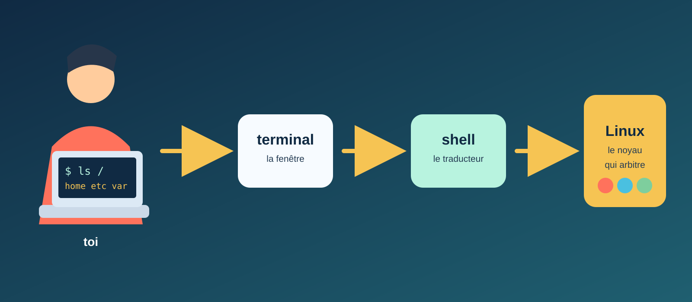
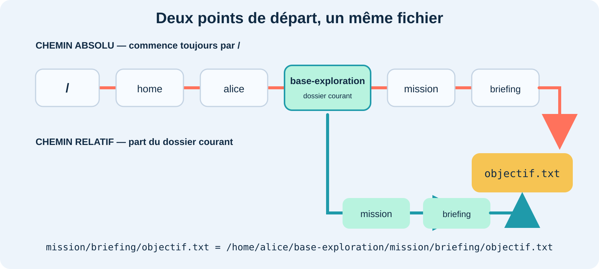
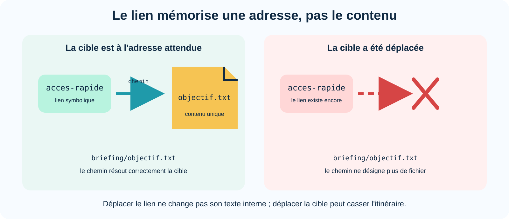
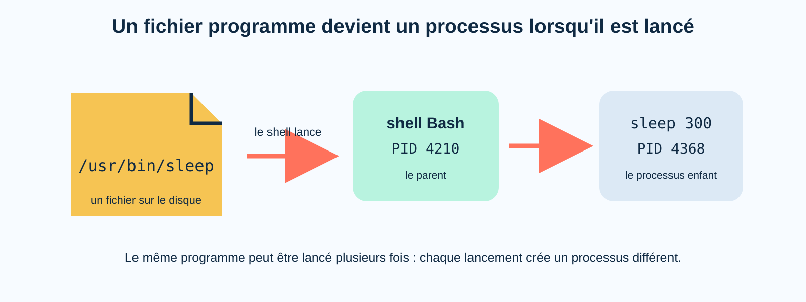
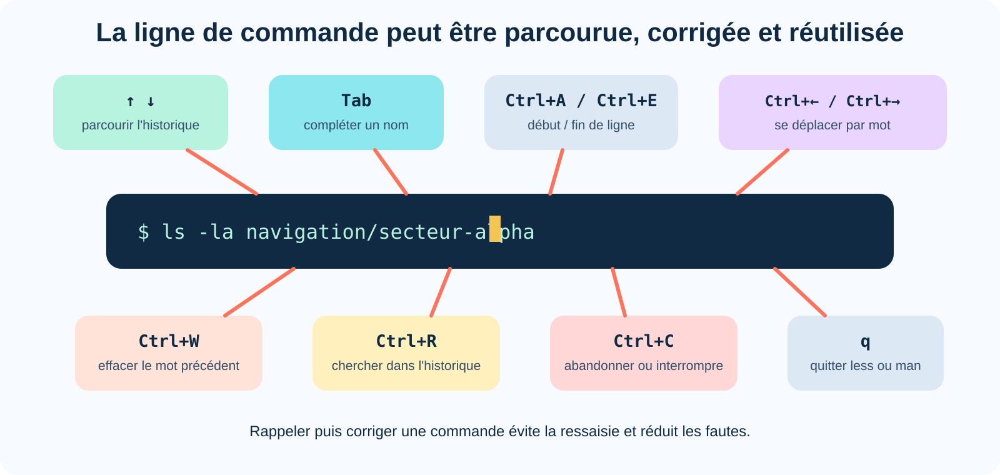
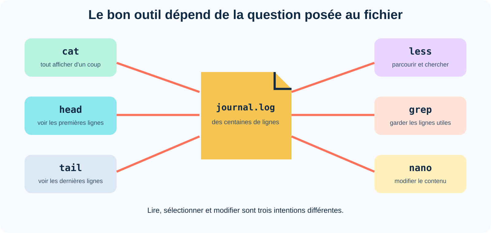

# TP 1 et TP 1.5 — Repères visuels et notions clés

Cette annexe rassemble les idées essentielles des TP **Premier contact avec Linux** et **Reprendre le contrôle du terminal**. Elle relie les commandes observées à une vue d'ensemble du système : qui interprète une commande, comment les fichiers sont organisés, comment parcourir de grands textes et pourquoi les droits se comportent ainsi.

## Carte des notions

| Notion | Observation dans le terminal | Idée essentielle |
|---|---|---|
| terminal, shell et noyau | `whoami`, `ls` | l'interface, l'interpréteur et le cœur du système ont des rôles différents |
| arborescence | `ls /` | tous les chemins appartiennent à un arbre unique qui part de `/` |
| chemins | `pwd`, `cd`, `..`, `~` | un chemin décrit un itinéraire absolu ou relatif |
| redirections | `echo`, `>`, `>>`, `<` | le shell choisit où circulent les données |
| commandes internes | `type cd`, `type ls` | certaines commandes modifient le shell lui-même, d'autres sont des programmes séparés |
| droits | `ls -l`, `chmod` | `r`, `w` et `x` changent de sens selon l'objet |
| liens symboliques | `ln -s`, `ls -l` | un lien mémorise un chemin, pas une copie |
| processus | `sleep 300 &`, `jobs`, `ps` | un programme lancé devient un processus identifié par un PID |
| édition de ligne | Tab, historique, `Ctrl+A`, `Ctrl+R` | le shell permet de compléter, rappeler et corriger sans tout retaper |
| observation des fichiers | `ls -lah`, `head`, `tail`, `less` | chaque outil répond à une question différente sur les données |
| recherche | `grep`, `grep -n`, `grep -i` | un motif sélectionne les lignes utiles sans modifier le fichier |
| édition de texte | `nano` | lire et modifier sont deux intentions différentes |
| droits numériques | `chmod 640`, `chmod 750` | `r`, `w` et `x` valent respectivement 4, 2 et 1 |

!!! warning "Périmètre sûr"
    Les manipulations restent dans `~/base-exploration`, sans `sudo`. Les changements de droits portent uniquement sur les fichiers extraits dans le laboratoire du TP.

---

## 1. Terminal, shell, noyau : qui fait quoi ?



Le **terminal** affiche du texte et transmet les frappes du clavier. Le **shell** — souvent Bash — interprète la ligne saisie, prépare la commande puis lance le programme demandé. Les logiciels ne pilotent pas directement le matériel : ils demandent des services au **noyau Linux** au moyen d'appels système.

Le noyau occupe donc une place centrale. Il arbitre l'accès au processeur, isole la mémoire, contrôle les droits sur les fichiers et dialogue avec les périphériques grâce à des pilotes.

```text
commande saisie
      ↓
terminal → shell → programme
                     ↕ appels système
                 noyau Linux
                     ↕ pilotes
     processeur · mémoire · disque · réseau · écran
```

!!! info "Un nom à double sens"
    Dans la vie courante, « Linux » désigne souvent tout le système. Techniquement, Linux est le noyau ; les commandes comme Bash, `ls` ou `grep` sont d'autres logiciels assemblés autour de lui.

**Question de réflexion :** si dix programmes veulent utiliser le processeur en même temps, quel composant décide quand chacun peut travailler ?

---

## 2. La carte du territoire


```text
/
├── home/       espaces personnels, par exemple /home/alice
├── root/       espace personnel de l'administrateur root
├── etc/        configuration de la machine
├── tmp/        fichiers temporaires
├── usr/        grande partie des programmes installés
└── var/        données variables : journaux, caches, files d'attente…
```

Linux présente une seule grande arborescence qui commence par `/`. Un disque, une clé USB ou un partage réseau vient se raccorder à cet arbre à un **point de montage** : il n'apparaît pas nécessairement sous une nouvelle lettre comme sous Windows.

Selon la distribution, certains chemins peuvent différer. Sur beaucoup de systèmes récents, `/bin` est un lien symbolique vers `/usr/bin`. Les anciens noms restent ainsi disponibles sans dupliquer les programmes.

!!! info "Pourquoi `/etc` ?"
    Le nom vient historiquement de *et cetera* : ce répertoire accueillait les fichiers système qui n'entraient pas ailleurs. Il est progressivement devenu le lieu principal de la configuration.

**Question de réflexion :** dans quel répertoire chercher un journal qui grossit avec le temps ?

---

## 3. Les chemins sont des itinéraires



Un chemin n'est pas l'objet lui-même : c'est l'itinéraire utilisé pour l'atteindre.

```text
/home/alice/base-exploration/mission/briefing/objectif.txt
└──────────────────── chemin absolu : départ à la racine /

mission/briefing/objectif.txt
└──────────────────── chemin relatif : départ dans le dossier courant
```

| Écriture | Signification |
|---|---|
| `/` | racine de toute l'arborescence |
| `.` | dossier courant |
| `..` | dossier parent |
| `~` | dossier personnel de l'utilisateur |
| `cd` sans argument | retour au dossier personnel dans Bash |

Si le dossier courant est `/home/alice/base-exploration`, les deux chemins suivants désignent le même fichier :

```text
mission/briefing/objectif.txt
/home/alice/base-exploration/mission/briefing/objectif.txt
```

Le premier dépend du point de départ ; le second reste valable quel que soit le dossier courant.

---

## 4. Les redirections : où part le texte ?


```text
echo "Bonjour"             → texte affiché dans le terminal
echo "Bonjour" > note.txt  → texte écrit dans un fichier ; ancien contenu remplacé
echo "Bonjour" >> note.txt → texte ajouté à la fin du fichier
cat < note.txt              → contenu du fichier fourni à cat
```

Les symboles `>`, `>>` et `<` ne sont pas des options de `echo` ou de `cat`. Le shell les traite avant de lancer la commande et branche les flux au bon endroit.

!!! danger "`>` remplace le contenu"
    La redirection `>` vide d'abord le fichier cible s'il existe. `>>` conserve le contenu et ajoute les nouvelles données à la fin.

---

## 5. Commandes internes et programmes externes

```text
shell Bash
 ├── cd                  commande interne : modifie le shell courant
 ├── echo                souvent interne
 └── lance /usr/bin/ls   programme externe : travaille puis se termine
```

`ls` peut travailler dans un processus séparé puis disparaître. `cd`, au contraire, doit modifier le dossier courant du shell qui attend la prochaine commande. Si un programme séparé changeait de dossier, lui seul se déplacerait ; le shell resterait au même endroit.

La commande `type` permet de découvrir ce que Bash lancera réellement :

```bash
type cd
type ls
type echo
```

!!! info "L'aide fait partie du travail"
    Les pages `man`, les options `--help` et la commande `type` ne sont pas des roues de secours pour débutants. Les administrateurs les utilisent quotidiennement : savoir retrouver une information fiable compte davantage que mémoriser toutes les options.

---

## 6. Les droits : trois lettres, deux significations


| Droit | Sur un fichier | Sur un répertoire |
|---|---|---|
| `r` — read | lire son contenu | lister les noms qu'il contient |
| `w` — write | modifier son contenu | ajouter, renommer ou supprimer des noms |
| `x` — execute | exécuter le fichier | traverser le répertoire dans un chemin |

La différence entre le fichier et son entrée dans un répertoire explique un résultat parfois surprenant :

```text
mission/coffre/          contient une liste de noms
        │
        └── code.txt     désigne le fichier contenant CODE-ALPHA-42
```

Supprimer `code.txt` revient d'abord à retirer le nom `code.txt` de la liste tenue par `coffre/`. Le droit d'écriture du répertoire est donc déterminant, même si le fichier lui-même est en lecture seule.

Les droits affichés par `ls -l` sont répartis entre le propriétaire (`u`), le groupe (`g`) et les autres (`o`). Un fichier créé pendant le TP appartient normalement à la personne connectée.

---

## 7. Lien symbolique : un panneau, pas une copie



```text
acces-rapide  ── contient le chemin ──>  briefing/objectif.txt
                                                  │
                                                  ▼
                                          véritable fichier
```

Un lien symbolique contient une adresse. Il ne duplique ni le contenu ni les droits de sa cible. Si la cible change de nom ou de place, le lien existe encore mais son itinéraire ne mène plus à un objet valide : il est **cassé**.

Cette indirection est pratique pour conserver un nom stable — par exemple `version-courante` — pendant que la cible réelle évolue de `version-1` à `version-2`.

---

## 8. Programme, processus et parenté



```text
programme : /usr/bin/sleep     fichier immobile sur le disque

shell Bash (PID 4210)
└── sleep 300 (PID 4368)       processus vivant, lancé maintenant
```

Un même programme peut être lancé dix fois : dix processus distincts existent alors, chacun avec son propre **PID**. Le shell qui lance une commande est le processus parent. La commande `jobs` connaît précisément les tâches lancées depuis ce shell.

!!! info "Que vaut un PID ?"
    Un PID n'est pas l'identité permanente d'un programme. Il est attribué à un processus vivant et pourra être réutilisé après sa fin. Il faut donc toujours vérifier la cible avant d'utiliser `kill`.

---

## 9. Le terminal est aussi un éditeur de ligne



La ligne affichée après l'invite n'est pas envoyée caractère par caractère à Linux. Le shell attend la validation avec Entrée ; avant cela, la ligne peut être parcourue, corrigée et complétée.

| Raccourci | Action |
|---|---|
| `↑` / `↓` | rappeler les commandes précédentes ou suivantes |
| `Tab` | compléter un nom à partir des entrées réellement disponibles |
| `Ctrl+A` / `Ctrl+E` | rejoindre le début ou la fin de la ligne |
| `Ctrl+←` / `Ctrl+→` | se déplacer par mot ; `Alt+B` / `Alt+F` est une variante fréquente |
| `Ctrl+W` | effacer le mot précédent |
| `Ctrl+R` | rechercher dans l'historique |
| `Ctrl+C` | abandonner la ligne ou demander l'interruption du processus au premier plan |

La commande `history 10` affiche les dix dernières entrées connues de Bash. Les flèches et `Ctrl+R` parcourent le même historique de manière interactive.

La complétion avec Tab n'est pas seulement un gain de temps. Elle vérifie progressivement qu'un nom existe. Si plusieurs possibilités correspondent, une nouvelle pression sur Tab peut les afficher.

!!! info "L'historique conserve du texte"
    L'historique évite la ressaisie, mais il répète aussi les erreurs. Une commande rappelée doit être relue avant Entrée, en particulier lorsqu'elle modifie ou supprime un fichier.

---

## 10. Choisir comment consulter un fichier



| Intention | Outil adapté | Le fichier est-il modifié ? |
|---|---|---|
| afficher un petit fichier entier | `cat` | non |
| observer ses premières lignes | `head` | non |
| observer ses dernières lignes | `tail` | non |
| parcourir et chercher sans modifier | `less` | non |
| sélectionner les lignes correspondant à un motif | `grep` | non |
| modifier le texte | `nano` | oui, après enregistrement |

`less`, `head`, `tail` et `grep` évitent de confondre « lire un fichier » avec « afficher toutes ses lignes ». Le choix de l'outil part de la question : début, fin, occurrence précise, parcours libre ou modification.

```text
head -n 5 journal.log      cinq premières lignes
tail -n 5 journal.log      cinq dernières lignes
grep -n 'ERREUR' journal   lignes correspondantes avec leur numéro
less journal.log           parcours interactif ; /mot cherche, q quitte
```

---

## 11. `grep` reçoit d'abord un motif, puis un fichier

```text
grep [options] 'motif recherché' fichier
 │       │             │           │
 │       │             │           └── données à examiner
 │       │             └────────────── règle de sélection
 │       └──────────────────────────── comportement supplémentaire
 └──────────────────────────────────── programme
```

Dans la commande suivante, les arguments sont inversés :

```bash
grep transmissions/radio.log ANOMALIE
```

`grep` cherche alors le texte `transmissions/radio.log` dans un fichier nommé `ANOMALIE`. Le message `No such file or directory` ne signifie donc pas que `grep` est absent : il révèle la façon dont les arguments ont été interprétés.

`grep` affiche les lignes correspondantes sur sa sortie normale. Il ne retire aucune ligne du fichier d'origine.

---

## 12. Droits symboliques et droits numériques


Les deux commandes suivantes décrivent le même objectif :

```bash
chmod u=rw,g=r,o= document.txt
chmod 640 document.txt
```

Le mode numérique additionne trois valeurs dans chacune des trois catégories :

```text
r = 4     w = 2     x = 1

7 = rwx   6 = rw-   5 = r-x   4 = r--
3 = -wx   2 = -w-   1 = --x   0 = ---
```

Les chiffres suivent toujours l'ordre `u`, `g`, `o`. Il n'existe pas de chiffre `8` ou `9`, car trois droits binaires ne produisent que huit combinaisons, de `0` à `7`.

!!! info "Deux notations complémentaires"
    La forme symbolique exprime bien une intention — « ajouter l'exécution au propriétaire » avec `u+x`. La forme numérique exprime directement un état complet — « fixer le mode à `750` ». Utiliser l'une ou l'autre dépend du changement recherché.

---

## 13. Propriétaire, groupe et autres : une seule catégorie s'applique

```text
utilisateur courant
       │
       ├── est propriétaire ?  → appliquer les droits u
       │
       ├── sinon, appartient au groupe ? → appliquer les droits g
       │
       └── sinon → appliquer les droits o
```

Les trois groupes de droits ne s'additionnent pas. Si Alice possède un fichier réglé sur `040`, elle ne peut pas le lire en tant que membre du groupe : Linux reconnaît d'abord qu'elle est propriétaire et applique uniquement les droits `u`, qui valent ici `---`.

Cette règle explique l'expérience :

```bash
chmod u=,g=r,o= groupe-seul.txt
cat groupe-seul.txt               # refusé pour son propriétaire
```

Pour un répertoire, l'accès combine généralement plusieurs droits : `r` permet de lire la liste des noms, `x` de traverser et d'accéder aux entrées connues, et `w` avec `x` de créer, supprimer ou renommer des entrées.

---

## Diagnostic rapide

| Message ou situation | Signification probable | Vérification utile |
|---|---|---|
| `No such file or directory` | le chemin ne désigne rien depuis l'endroit courant | contrôler `pwd`, puis `ls` à chaque niveau du chemin |
| `Permission denied` | le système refuse l'action demandée | identifier l'action (`r`, `w` ou `x`) et l'objet concerné |
| `command not found` | le shell ne trouve pas la commande | vérifier l'orthographe, puis utiliser `type` ou `command -v` |
| la racine `/` semble risquée | observer l'arborescence ne la modifie pas | `ls /` ne fait que lire ; `cd ~` ramène au dossier personnel |
| un lien est cassé | la cible a changé ou disparu | lire la flèche de `ls -l` et vérifier le chemin indiqué |
| `sleep` semble ne rien faire | le programme attend, comme demandé | l'observer avec `jobs` ou `ps` |
| `head` essaie d'ouvrir un fichier nommé `5` | l'option `-n` a été oubliée | utiliser `head -n 5 fichier` |
| `grep` cherche dans le mauvais fichier | le motif et le nom du fichier sont inversés | relire la forme `grep 'motif' fichier` |
| `nano` semble conserver une ancienne version | les changements n'ont pas été enregistrés | utiliser `Ctrl+O`, confirmer avec Entrée, puis quitter avec `Ctrl+X` |
| un mode comme `758` est refusé | un chiffre de droits doit être compris entre 0 et 7 | recalculer chaque catégorie avec 4, 2 et 1 |
| le propriétaire ne profite pas du droit `g` | Linux a déjà sélectionné la catégorie `u` | définir explicitement les droits du propriétaire |

## À retenir

- Le terminal est une interface, le shell interprète les commandes et le noyau contrôle les ressources.
- `/` est le départ de toute l'arborescence ; `~` désigne le dossier personnel.
- Un chemin relatif dépend du dossier courant, un chemin absolu part de `/`.
- Les redirections sont préparées par le shell.
- Les droits sur un fichier et sur un répertoire ne décrivent pas les mêmes actions.
- Un lien symbolique stocke un chemin ; un processus est un programme en cours d'exécution.
- L'historique et la complétion permettent de réutiliser une commande tout en vérifiant ses chemins.
- `cat`, `less`, `head`, `tail`, `grep` et `nano` répondent à des intentions différentes.
- Les notations `u=rw,g=r,o=` et `640` peuvent décrire le même ensemble de droits.
