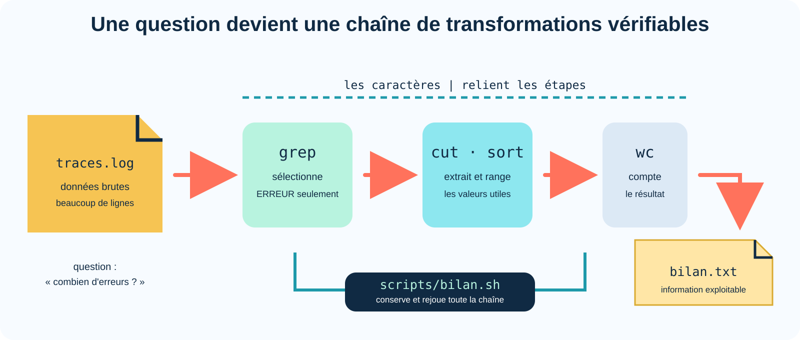
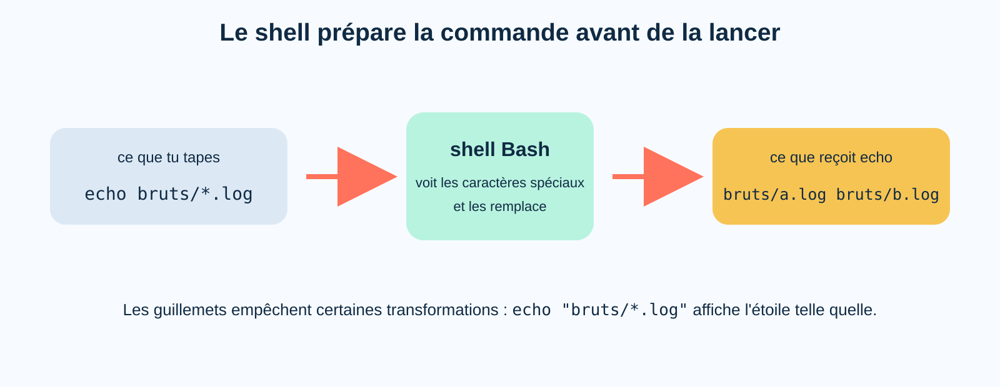
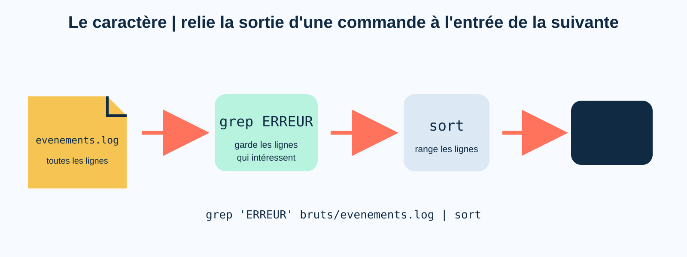
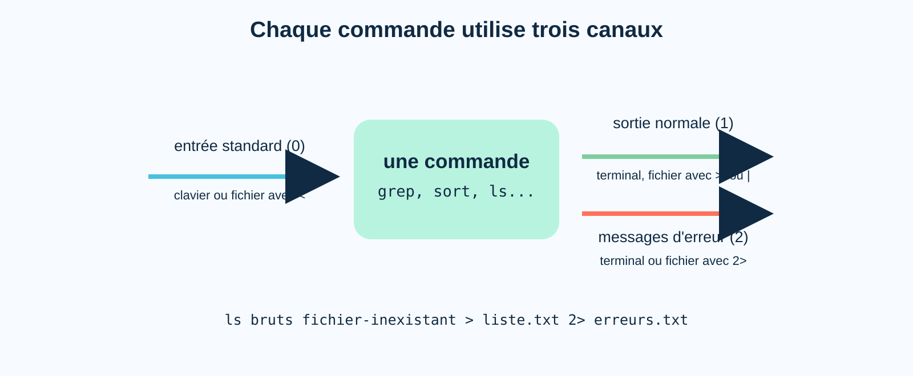
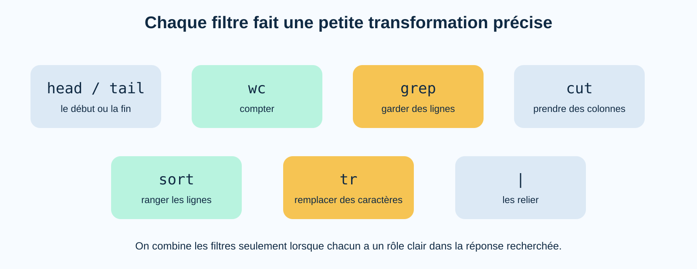
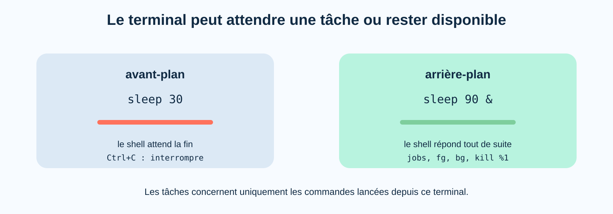
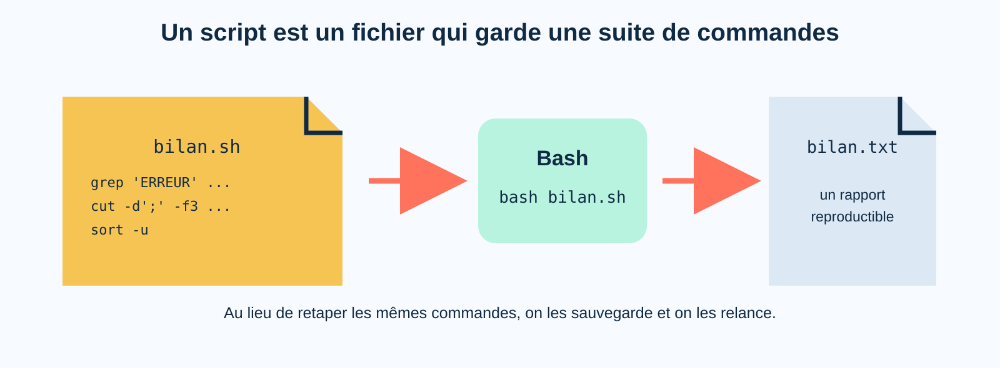

# TP 2 — Repères visuels et notions clés

Cette annexe prolonge le TP **Lire les traces d'un poste**. Elle montre comment le shell transforme une ligne de commande, relie de petits outils et produit des rapports reproductibles à partir de données brutes.

## Vue d'ensemble : des traces au rapport



```text
fichiers bruts → sélection → transformation → tri ou comptage → rapport
     logs          grep        cut · tr         sort · wc          >
```

Le principe directeur est simple : chaque commande accomplit une opération limitée et vérifiable. Le caractère `|` transmet le résultat à l'étape suivante ; une redirection finale conserve le résultat dans un fichier.

## Carte des notions

| Notion | Exemple | Idée essentielle |
|---|---|---|
| transformations du shell | `*`, guillemets, `$(date)` | Bash prépare les mots avant de lancer la commande |
| conduite | `grep ... | wc -l` | la sortie de gauche devient l'entrée de droite |
| flux standard | `>`, `2>`, `<` | résultat normal et erreurs circulent sur des canaux distincts |
| filtres | `cut`, `sort`, `tr`, `grep` | chaque outil réalise une transformation simple |
| tâches du terminal | `sleep`, `jobs`, `fg`, `bg` | avant-plan et arrière-plan décrivent le lien entre le shell et ses tâches |
| scripts | `bash scripts/bilan.sh` | un fichier texte conserve une suite de commandes reproductible |

!!! warning "Périmètre sûr"
    Tous les fichiers créés restent dans `~/base-exploration/analyse-traces`. La seule cible de `kill` est le processus `sleep` lancé dans le même terminal pendant le TP.

---

## 1. Le shell prépare les mots



```text
ligne saisie             préparation par Bash          arguments reçus par echo
echo bruts/*.log    →    recherche des noms       →    bruts/evenements.log
echo "bruts/*.log"  →    étoile protégée          →    bruts/*.log
echo "$(date +%F)"   →    commande exécutée        →    2026-09-14
```

Bash ne transmet pas toujours les caractères tels qu'ils ont été tapés. Il reconnaît et développe notamment `*`, `~`, les accolades et `$(...)`. Les guillemets contrôlent ces transformations.

La commande appelée ne voit généralement que le résultat final. Ainsi, `echo` ne recherche aucun fichier : le shell remplace d'abord `*.log` par les noms correspondants, puis fournit ces noms à `echo`.

!!! info "L'étoile existait avant Unix"
    L'astérisque comme joker vient des premiers systèmes de traitement de texte et s'est imposé dans les shells. Son développement par le shell permet à de nombreuses commandes de l'utiliser sans contenir chacune leur propre moteur de recherche de fichiers.

**Question de réflexion :** pourquoi `echo "*.log"` affiche-t-il une étoile au lieu d'une liste de fichiers ?

---

## 2. Une conduite : plusieurs outils, une seule ligne



```text
fichier → grep "ERREUR" → sort → terminal
             garde          range
          certaines lignes  le résultat
```

Le caractère `|` relie directement la sortie normale de la commande de gauche à l'entrée standard de celle de droite. Il ne crée pas de fichier intermédiaire.

```bash
grep 'ERREUR' bruts/evenements.log | wc -l
```

Cette ligne se lit de gauche à droite : « sélectionner les lignes contenant `ERREUR`, puis compter les lignes sélectionnées ».

!!! info "Pourquoi parler de *pipe* ?"
    Dans Unix, un tube est un petit espace mémoire géré par le noyau. Pendant que la première commande y écrit, la suivante peut déjà lire : les étapes d'une longue chaîne peuvent donc travailler en même temps.

---

## 3. Trois canaux, pas un seul bloc de texte



```text
clavier ou fichier  → entrée standard  (0) →
                                             commande
terminal ou fichier ← sortie normale   (1) ←
terminal ou fichier ← sortie d'erreur  (2) ←
```

Une commande lit son **entrée standard** et peut écrire sur deux sorties différentes : son résultat normal et ses messages d'erreur. Le shell branche ces canaux avec `<`, `>`, `>>`, `2>` et `|`.

```bash
ls dossier-existant dossier-absent > liste.txt 2> erreurs.txt
```

Dans cet exemple, les noms trouvés vont dans `liste.txt` et le message concernant le dossier absent va dans `erreurs.txt`. Cette séparation permet d'automatiser un traitement sans confondre données et diagnostic.

---

## 4. Une boîte à outils de filtres



| Outil | Transformation principale | Exemple de lecture |
|---|---|---|
| `head`, `tail` | choisir le début ou la fin | « les 10 premières lignes » |
| `wc` | compter | « combien de lignes ? » |
| `grep` | garder ou exclure des lignes | « seulement les erreurs » |
| `cut` | extraire des champs | « seulement la colonne utilisateur » |
| `sort` | ranger et dédupliquer | « valeurs triées et uniques » |
| `tr` | remplacer des caractères | « minuscules transformées en majuscules » |

Une analyse devient plus lisible lorsqu'elle est décomposée en verbes : sélectionner, extraire, normaliser, trier, compter. Chaque verbe correspond à un filtre testable séparément.

```bash
cut -d';' -f2 bruts/connexions.csv | sort -u
```

La chaîne extrait le deuxième champ, puis ne conserve qu'une occurrence de chaque valeur.

!!! info "Une philosophie de construction"
    Les premiers outils Unix ont été pensés comme de petites pièces combinables. Cette approche évite de réécrire un grand programme pour chaque nouvelle question : on réassemble des transformations déjà fiables.

---

## 5. Les tâches liées au terminal



```text
sleep 20       le shell attend la tâche : avant-plan
sleep 90 &     l'invite revient immédiatement : arrière-plan

jobs           liste les tâches connues de ce shell
fg             replace une tâche au premier plan
bg             reprend une tâche suspendue en arrière-plan
```

Les tâches affichées par `jobs` ne représentent pas tous les processus de la machine. Elles appartiennent à ce shell, qui connaît leur état parce qu'il les a lancées.

Le symbole `&` n'accélère pas la commande. Il rend l'invite disponible pendant que le processus continue. Un numéro de tâche comme `%1` est local au shell ; un PID identifie le processus dans le système.

!!! danger "Toujours identifier la cible"
    Avant `kill %1`, `jobs` doit montrer que la tâche visée est bien le `sleep` créé pour l'exercice.

---

## 6. Un script conserve la recette



```text
bilan.sh                         Bash                       bilan.txt
-----------------        -------------------        -----------------
grep ... | wc -l   →     exécute les lignes   →     rapport produit
cut ... | sort -u          dans leur ordre
```

Un script Bash est un fichier texte contenant des commandes qui pourraient être saisies une par une. La commande suivante demande à Bash de lire la recette et de l'exécuter :

```bash
bash scripts/bilan.sh
```

Le script est la **recette** ; le rapport est le **résultat**. Lorsque les données brutes changent, la même recette peut produire un rapport actualisé. Cette reproductibilité facilite la vérification, la correction et l'automatisation.

!!! info "Des programmes lisibles"
    Bien avant les outils modernes, les programmes étaient déjà des suites d'instructions conservées pour être rejouées. Un script poursuit cette idée avec un avantage précieux : son texte reste directement lisible et modifiable.

---

## Diagnostic rapide

| Situation | Signification probable | Vérification utile |
|---|---|---|
| `grep` n'affiche rien | aucune ligne ne correspond | vérifier le mot, la casse et le fichier source |
| `*.log` reste affiché | aucun nom ne correspond, ou les guillemets protègent `*` | examiner `ls bruts` et les guillemets |
| le rapport est vide | la sélection ne trouve rien ou le flux part ailleurs | tester chaque partie de la conduite séparément |
| un fichier a été remplacé | `>` l'a vidé avant d'écrire | utiliser `>>` uniquement lorsqu'un ajout est voulu |
| `fg` ne trouve aucune tâche | la tâche est terminée ou n'appartient pas à ce shell | consulter `jobs`, puis relancer un `sleep` si nécessaire |
| le script produit des caractères inattendus | les guillemets ont agi au mauvais moment | lire le script avec `cat` et repérer chaque développement attendu |

## À retenir

- Bash transforme certains caractères avant de lancer une commande ; les guillemets modifient ces transformations.
- Une conduite se lit de gauche à droite et transmet des données sans fichier intermédiaire.
- La sortie normale et la sortie d'erreur sont deux canaux distincts.
- Les filtres sont de petits outils spécialisés que l'on peut composer.
- `jobs`, `fg` et `bg` concernent les tâches connues du shell courant.
- Un script conserve une recette afin de produire à nouveau le même type de résultat.
